# SmartTicket Analytics

**客服工单趋势与异常分析平台**　·　基于 50 条真实客服工单数据的数据分析与异常发现项目

| 交付入口 | 地址 |
| --- | --- |
| **GitHub 仓库** | <https://github.com/messiiss/SmartTicket-Analytics> |
| **在线演示（已部署）** | <http://134.185.89.68:8501> |

> 在线演示由 Docker 部署在云服务器上（Oracle Linux 9.7 / aarch64），容器健康检查通过，
> 打开即可交互查看全部 8 个页面，无需本地安装任何环境。

> 本项目的所有指标、趋势与异常结论，均由程序基于 `data/tickets.json` **实时计算**得出，
> 不存在任何硬编码结果或编造数据。可复现：`python run_analysis.py`。

---

## 快速预览

<p align="center">
  <a href="screenshots/dashboard_overview.png">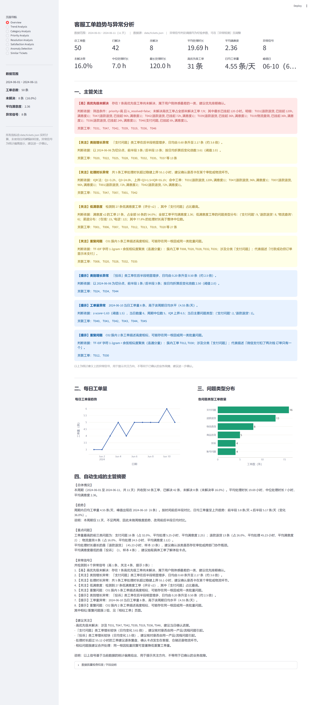</a>
</p>

<p align="center">
  <sub>Dashboard 首页：核心 KPI（总工单 50 / 已解决 42 / 未解决 8 / 平均处理时长 19.69h / 平均满意度 2.36 / 异常信号 8）
  与按严重程度分级的「主管关注」异常信号区。图为真实运行截图，可点击查看原图。</sub>
</p>

> 全部页面截图见文末 **[第 12 节 · 项目截图](#12-项目截图)**。

---

## 1. 项目背景

客服主管每天面对的是「一屏屏滚不完的工单列表」。他真正需要回答的问题只有三个：

1. **最近什么问题变多了？**（趋势）
2. **哪些事情现在就必须处理？**（高优先级未闭环）
3. **有没有同一类问题在反复出现，其实可以一次性解决？**（重复问题）

现状是主管只能靠人工翻列表，效率低、容易漏。本项目把这三个问题变成一套**可自动运行、结论有据可查**的分析工具。

---

## 2. 项目目标

- **趋势发现**：每日工单量、高优先级工单量、前后半段日均对比
- **异常检测**：6 类异常信号，每条都附带判断依据（evidence）与严重程度
- **问题聚类 / 相似问题**：TF-IDF + 余弦相似度，自动发现同一根因的批量工单
- **管理决策辅助**：Dashboard + 自动生成的主管摘要，把精力导向真正值得关注的事情

**非目标（刻意不做）**：不做主观打分（不评「最重要问题」「最佳渠道」），不把统计偏离描述为已确认的业务故障。

---

## 3. 技术栈

| 层次 | 技术 | 选择理由 |
| --- | --- | --- |
| 语言 | Python 3.11+ | 数据处理生态成熟，`pathlib` / `dataclasses` / `typing` 保证代码质量 |
| 数据处理 | pandas、numpy | 50 条结构化工单的标准工具；分位数、IQR、透视表开箱即用 |
| 可视化 | plotly | 支持 hover 交互，中文友好，图表可独立交互式查看 |
| Web Dashboard | streamlit | 纯 Python 即可交付可交互页面，无需前端工程化，24 小时内可交付 |
| 文本分析 | scikit-learn（TF-IDF + cosine similarity） | 相似问题发现，无需额外分词依赖（见下） |
| 测试 | pytest | 41 个用例覆盖加载、清洗、指标、异常检测 |

### 3.1 为什么没有使用 LangChain / RAG / 向量数据库

这是**主动的技术选型决策**，不是能力缺失：

- **数据形态**：约 50 条**结构化**工单，字段明确（分类、优先级、时长、满意度）。核心任务是分组统计、趋势计算、异常判定——全部是确定性的算术，交给 LLM 只会引入不确定性和不可复现的结论。
- **无检索需求**：RAG 解决的是「从大规模语料中检索相关知识」。50 条工单全量读入内存即可，引入向量库属于纯粹的过度设计。
- **无编排需求**：分析链路是线性的（加载 → 清洗 → 指标 → 异常 → 报告），不需要 LangGraph 这类有状态编排框架。用普通函数串联更清晰、更易调试。
- **可复现性优先**：测评与生产都要求「同样的数据跑出同样的结论」。规则化的稳健统计（IQR / 前后半段日均对比）恰好满足这一点。

### 3.2 关于中文分词

`TfidfVectorizer` 默认按词切分，对无空格的中文无效。本项目改用**字符 n-gram（1-2 gram）**，理由是：

- 客服工单描述短（9~20 字），且高频业务词集中（退款、扣款、快递、订单）；
- 字符 n-gram 无需引入 jieba 等额外依赖，零环境风险；
- 实测能准确把「付款成功但订单显示未支付 / 信用卡支付成功了但订单没生成 / 系统显示支付成功 但仓库说没收到订单」聚为一簇。

---

## 4. 分析维度

| 分析维度 | 分析内容 | 对主管的价值 |
| --- | --- | --- |
| 时间趋势 | 每日工单量、前后半段日均对比、高优先级趋势 | 发现客服压力变化，判断是否突然增长 |
| 问题类型 | category 的数量 / 占比 / 平均处理时长 / 满意度 / 未解决数 | 发现集中问题，定位「量多 + 慢 + 差评」的类别 |
| 优先级 | priority 分布、未解决数、未解决率 | 识别高风险工单是否积压 |
| 处理效率 | 均值 + 中位数 + P90 + IQR 上界 + 长时间工单 | 发现处理瓶颈（只看均值会被极端值误导） |
| 满意度 | 评分分布、category/priority/channel × 满意度交叉 | 发现体验问题与低满意度集中区 |
| 渠道 | 在线 / 电话的数量、时长、满意度、未解决率 | 了解渠道差异，辅助人力分配 |
| 文本相似度 | description 的 TF-IDF + 余弦相似度聚类 | 发现重复问题，支持批量一次性解决 |

---

## 5. 异常检测方法

本项目共定义 **6 类异常信号**。每条信号的结构固定为：

```json
{
  "type": "类别增长异常",
  "description": "「支付问题」类工单在后半段明显增多，日均由 0.60 条升至 2.17 条（约 3.6 倍）。",
  "evidence": "以 2024-06-06 为切分点，前半段 3 条 / 后半段 13 条；按日均折算后变化倍数 3.61（阈值 2.00）。",
  "severity": "关注",
  "related_tickets": ["T016", "T020", "T022", "..."],
  "metric": {"category": "支付问题", "early_daily": 0.6, "late_daily": 2.17, "ratio": 3.61}
}
```

| 类型 | 判定方法 | 阈值（经验参数） | 为什么这样设计 |
| --- | --- | --- | --- |
| **A 工单量异常** | 每日工单量的 z-score 与 IQR 上界双重判定 | z ≥ 1.5 或超 IQR 上界 | 单日波动在 50 条数据里噪声大，需双条件收敛 |
| **B 类别增长异常** | 以时间中点为切分，比较某类别**前后半段的日均产出** | 倍数 ≥ 2.0 且后半段 ≥ 3 条 | 两段时间天数不同，直接比绝对数量会假性增长；日均折算才可比 |
| **C 处理时长异常** | IQR 稳健上界法 | Q3 + 1.5×IQR，且不低于 24 小时 | 均值易被 120 小时这类极端值拉偏；IQR 对长尾更稳健 |
| **D 低满意度** | satisfaction ≤ 2，并与处理时长 / 类别 / 优先级 / 渠道交叉 | 阈值 2 分 | 单独看「差评数」没有行动价值，必须给出集中在哪一类 |
| **E 高优先级未解决** | priority = 高 且 is_resolved = false | 命中 1 条即报 | 用户体感最差、最需要当天闭环的运营信号 |
| **F 重复问题** | TF-IDF + 余弦相似度聚类（连通分量） | 相似度 ≥ 0.30（可调） | 同一根因批量出现，合并处理收益最高 |

### 5.1 严重程度的判定规则（非主观打分）

| 等级 | 规则 |
| --- | --- |
| 高 | 直接影响用户资金 / 账号安全，或高优先级工单长期未闭环 |
| 关注 | 指标超过稳健阈值明显偏离，但样本量有限，需人工确认 |
| 提示 | 轻度偏离或趋势性变化，用于持续观察 |

### 5.2 措辞规范

所有输出统一使用「**异常信号**」「**建议进一步确认**」，不写成「系统出现故障」。
这是刻意的：50 条样本的统计偏离不足以支撑业务故障结论，工具的作用是**把注意力引向值得查的地方**，而不是替业务下判断。

---

## 6. 关键发现（基于真实 `tickets.json` 计算）

> 以下数字全部来自 `python run_analysis.py` 的实际输出，数据范围 **2024-06-01 ~ 2024-06-11（11 天）**。

**总体**

- 共 **50 条**工单，**已解决 42 条**，**未解决 8 条**（未解决率 **16.0%**）
- 平均处理时长 **19.69 小时**，但**中位数仅 7 小时**，最长 **120 小时** —— 均值被长尾显著拉高
- 平均满意度 **2.36**（1 分 14 条、2 分 13 条、3 分 15 条、4 分 7 条、5 分 1 条），其中**低满意度（≤2 分）合计 27 条，占 54%**
- 高优先级工单 **31 条（62%）**，优先级分布明显偏高风险侧

**趋势**

- 日均工单量 **4.55 条/天**，峰值出现在 **2024-06-10（6 条）**
- 前后半段日均对比：**3.8 → 5.17 条/天（上升 36%）**，整体处于爬升状态
- 说明：数据仅 11 天、不足两周，**未做周维度趋势**，改用前后半段日均对比以避免周维度样本过少导致误导

**问题类型**

| 类别 | 工单数 | 占比 | 平均处理时长 | 平均满意度 | 未解决数 |
| --- | --- | --- | --- | --- | --- |
| 支付问题 | 16 | 32.0% | 5.25 h | 2.25 | 1 |
| 退款退货 | 13 | 26.0% | **45.23 h** | **2.00** | **5** |
| 物流查询 | 8 | 16.0% | 24.50 h | 2.12 | 2 |
| 商品咨询 | 5 | 10.0% | 0.90 h | 4.20 | 0 |
| 投诉 | 4 | 8.0% | 23.00 h | **1.00** | 0 |
| 账号问题 | 4 | 8.0% | 5.00 h | 3.50 | 0 |

两个结构性问题浮出水面：

1. **「退款退货」是典型的「量多 + 慢 + 差评 + 积压」类别**：占 26% 的工单量，平均处理 **45.23 小时**（约为商品咨询的 50 倍），平均满意度仅 **2.00**，13 条里有 **5 条至今未解决**（未解决率 **38.5%**，为全类最高；全部 8 条未解决工单中有 5 条属于这一类）。
2. **「投诉」类平均满意度 1.00**：虽然只有 4 条，但全部是 1 分，说明体验已经触底，属于需要复盘服务流程的信号。

**处理效率**

- IQR 稳健上界为 **55.1 小时**（Q1 = 3.2h，Q3 = 24.0h），超过上界的有 **5 条**：T031（120h）、T047（96h）、T007（96h）、T001（72h）、T042（72h）
- 这 5 条**全部属于「退款退货」**类别，且满意度全部为 1~2 分 —— 超长处理时长与差评在这个类别上高度叠加（仅表示相关，不代表因果）。这也解释了为什么该类别均值被拉到 45.23 小时

**重复/相似问题（这是最有行动价值的一块）**

阈值 0.30 下共发现 **6 组相似工单对、2 个问题簇**：

| 簇 | 工单数 | 工单 | 共同问题 |
| --- | --- | --- | --- |
| C01 | 5 | T008、T020、T028、T032、T035 | **付款成功但订单状态异常**（未支付 / 未生成 / 仓库未收到订单） |
| C02 | 2 | T012、T030 | **重复扣款** |

其中 C01 的 5 条工单跨越 6/3~6/9 共 7 天，描述分别是「付款成功但订单显示未支付」「信用卡支付成功了但订单没生成」「用支付宝付的钱显示扣款成功但订单还是待支付」「银行卡已经扣款了但订单没成功」「系统显示支付成功但仓库说没收到订单」——**同一根因在 7 天内反复发生 5 次**，是本次分析中最值得优先排查的系统性问题。

---

## 7. 数据质量

`data/tickets.json` + `data/ticket_fields.md` 的实际情况（由 `data_cleaner.py` 自动生成，非人工填写）：

| 检查项 | 结果 |
| --- | --- |
| 记录数 | 50 条（顶层为 JSON 数组） |
| 字段完整性 | 9 个字段**全部存在**，无缺失单元格 |
| 字段类型 | `is_resolved` 全部为布尔值；`resolution_time_hours` 49 条整数 + **1 条小数（T009 = 0.5 小时）** |
| 重复工单编号 | **0** 条 |
| 时间范围 | 2024-06-01 09:15 ~ 2024-06-11 15:45，中间无缺日期 |
| 合理性检查 | `satisfaction` 全部落在 1-5；`resolution_time_hours` 无负数 |
| 取值白名单 | `priority` 均在（高/中/低）；`category` 均在 6 类内；`channel` 仅出现（在线/电话）——**字段说明中提到的「邮件」渠道在数据中未出现** |

**处理方式说明（不静默修改）**：

- 所有检查结果都会写入 `DataQualityIssue`（含 level / field / ticket_id / 影响行数），在 Dashboard 的「数据质量检查结果」中可查看；
- 无法解析的时间、非法数值、超区间的满意度会被**置为空值并记录 warning**，而不是悄悄修正成一个猜测值；
- `data/tickets.json` 原文**从不被修改**，清洗只在内存副本上进行；
- 本次数据质量良好，因此实际未触发任何 error 级问题，唯一记录是 info 级的「处理时长包含小数」。

---

## 8. 项目运行与部署

### 8.1 本地运行

```bash
# 1. 创建虚拟环境
python -m venv .venv

# 2. 激活虚拟环境
# Windows:
.venv\Scripts\activate
# macOS / Linux:
source .venv/bin/activate

# 3. 安装依赖
pip install -r requirements.txt

# 4. 启动 Dashboard（默认 http://localhost:8501）
streamlit run app.py

# 5.（可选）命令行跑完整分析，输出 Markdown 报告
python run_analysis.py
python run_analysis.py --threshold 0.35 --out outputs/report.md   # 自定义相似度阈值
```

Dashboard 支持通过 URL 直接打开指定页面：`http://localhost:8501/?page=Anomaly%20Detection`

### 8.2 Docker 运行（推荐用于交付 / 演示）

不需要在宿主机安装 Python 依赖，一条命令即可起身：

```bash
docker compose up -d --build     # 构建镜像并后台启动
docker compose logs -f           # 查看日志
docker compose down              # 停止并移除容器
```

或者只用 Dockerfile：

```bash
docker build -t smartticket-analytics:1.0.0 .
docker run -d --name smartticket-analytics -p 8501:8501 \
  --restart unless-stopped smartticket-analytics:1.0.0
```

镜像要点：

- 基础镜像 `python:3.11-slim`，**同时支持 amd64 / arm64**，无需 `--platform` 指定架构；
- 先 `COPY requirements.txt` 再装依赖，改代码时依赖层命中缓存，重建只需数秒；
- 以非 root 用户 `appuser` 运行；
- 内置 `HEALTHCHECK`（用 Python 标准库探测 `/_stcore/health`，镜像内不依赖 curl）；
- `.dockerignore` 排除了 `.git`、`.venv`、缓存、截图与文档，构建上下文仅数百 KB。

### 8.3 云服务器部署（当前线上环境）

本项目已实际部署上线，环境与步骤如下：

| 项目 | 值 |
| --- | --- |
| **在线地址** | <http://134.185.89.68:8501> |
| 服务器系统 | Oracle Linux Server 9.7（aarch64，2 vCPU / 6.7 GB） |
| Docker | 29.6.1（已预装并 active） |
| 部署目录 | `/home/opc/SmartTicket-Analytics` |
| 容器名 | `smartticket-analytics` |
| 镜像 | `smartticket-analytics:1.0.0`（1.2 GB，arm64 原生构建） |
| 端口映射 | `0.0.0.0:8501 -> 8501/tcp` |
| 重启策略 | `unless-stopped`（服务器重启后自动拉起） |

部署命令（在云服务器上执行）：

```bash
# 1. 获取代码（二选一）
git clone https://github.com/messiiss/SmartTicket-Analytics.git
# 或本地打包上传：tar czf - --exclude=.git . | ssh opc@<host> 'tar xzf - -C ~/SmartTicket-Analytics'

# 2. 进入目录并构建启动
cd SmartTicket-Analytics
docker compose up -d --build

# 3. 验证
docker ps --filter name=smartticket          # 应显示 Up (healthy)
curl -s -o /dev/null -w '%{http_code}\n' http://127.0.0.1:8501/_stcore/health   # 应输出 200
```

**运维备忘**（实测记录）：

- 该服务器上同时运行着 14 个其它容器（代理 / Supabase / MinIO 等），本项目使用独立的容器名与
  独立的 compose network，**未改动任何既有容器**；
- 8501 端口在部署前未被占用，部署后由 `docker-proxy` 监听 `0.0.0.0:8501`；
- 若需更新版本：`git pull && docker compose up -d --build`；
- 若需查看实时日志：`docker logs -f smartticket-analytics`。

---

## 9. 测试

```bash
pytest -q
```

结果：**41 passed**（覆盖数据加载、清洗、指标计算、异常检测、空数据保护、阈值可配置性）。

```text
......................................................................... [100%]
41 passed in 2.38s
```

测试的断言策略是「交叉验证 + 锚点事实」：既与 pandas 直接计算的结果比对（防止模块内部算错），也对数据集本身的固定事实做锚点断言（如 50 条、8 条未解决、日期范围）。

---

## 10. 项目结构

```text
SmartTicket-Analytics/
│
├── data/
│   ├── tickets.json                  # 原始工单数据（只读，程序不修改）
│   └── ticket_fields.md              # 字段说明
│
├── src/
│   ├── __init__.py
│   ├── data_loader.py                # 加载 + 字段完整性检查（兼容包装结构、缺字段补列）
│   ├── data_cleaner.py               # 清洗 + 数据质量问题记录（不静默修改）
│   ├── metrics.py                    # KPI / 分组统计 / 分位数 / 相关性（Spearman）
│   ├── trend_analysis.py             # 每日趋势 / 前后半段日均对比 / 周趋势可用性判断
│   ├── anomaly_detection.py          # 6 类异常检测，输出带 evidence 的 AnomalySignal
│   ├── text_analysis.py              # TF-IDF + 余弦相似度 + 连通分量聚类
│   └── report_generator.py           # 模板化主管摘要 + Markdown 报告渲染
│
├── tests/
│   ├── conftest.py
│   ├── test_data_loader.py           # 加载、字段、异常路径（缺文件 / 坏 JSON / 空列表）
│   ├── test_metrics.py               # 指标交叉验证 + 空数据保护
│   └── test_anomaly_detection.py     # 异常逻辑、高优未解决、长时长识别、阈值可调
│
├── screenshots/                      # 真实运行截图
│   ├── dashboard_overview.png        # 首页 KPI + 主管关注区（整页）
│   ├── trend_analysis.png            # 时间趋势页
│   ├── anomaly_analysis.png          # 异常检测页
│   ├── category_analysis.png         # 问题类型页
│   ├── satisfaction_analysis.png     # 满意度页
│   ├── similar_tickets.png           # 相似工单页
│   ├── detail_manager_focus.png      # 细节放大：主管关注区
│   ├── detail_anomaly_evidence.png   # 细节放大：单条信号的判断依据
│   ├── detail_similar_clusters.png   # 细节放大：相似问题簇
│   ├── deployed_cloud.png            # 云服务器线上实例截图
│   ├── development_requirements.png  # 开发过程：任务需求拆解
│   ├── development_ai_chat.png       # 开发过程：AI 协作记录
│   └── README.md                     # 截图说明
│
├── outputs/
│   └── report.md                     # run_analysis.py 生成的完整分析报告
│
├── app.py                            # Streamlit Dashboard（8 个页面）
├── run_analysis.py                   # 命令行入口，与 Dashboard 共用同一套 src 模块
├── Dockerfile                        # 生产镜像（python:3.11-slim，amd64/arm64 通用）
├── docker-compose.yml                # 一键构建 + 启动（含健康检查与重启策略）
├── .dockerignore                     # 构建上下文瘦身
├── requirements.txt
├── .gitignore
└── README.md
```

**分层原则**：`app.py` 只负责页面渲染与交互，**不含任何业务计算**；所有指标、异常、相似度计算都在 `src/` 中，保证 CLI 报告与 Dashboard 的数字**必然一致**（同源同函数）。

---

## 11. AI 工具使用情况

AI 工具主要用于：

- **需求拆解**：把「分析工单趋势」拆成 6 个分析维度 + 6 类异常信号；
- **分析维度设计**：讨论「为什么用前后半段日均对比而不是绝对数量」这类方法论问题；
- **代码辅助**：模块骨架、type hints、pandas 用法、plotly 图表写法；
- **测试设计**：边界用例（空 DataFrame、缺字段、坏 JSON、阈值极端取值）；
- **README 整理**：结构组织与表达优化；
- **UI 优化建议**：Dashboard 信息层级、主管关注区的信息框设计。

**同时必须明确说明**：

> 所有数据统计、指标计算、异常判定和最终分析结论，**均由程序基于 `data/tickets.json` 计算得出**。
> AI 没有参与、也不会参与任何数字的生成——`src/` 中不存在任何硬编码的分析结果，
> README 第 6 节的每一个数字都可以通过 `python run_analysis.py` 复现。

---

## 12. 项目截图

### 截图 1 · Dashboard 首页（Overview）

整页图见文首 **[快速预览](#快速预览)** ｜ 原图：[`screenshots/dashboard_overview.png`](screenshots/dashboard_overview.png)

首屏包含 12 个 KPI：总工单数 **50**、已解决 **42**、未解决 **8**、平均处理时长 **19.69 h**、
平均满意度 **2.36**、异常信号 **8**、未解决率 **16.0%**、中位处理时长 **7.0 h**、最长处理时长 **120.0 h**。

**细节放大 · 「主管关注」异常信号区**（每条信号均带判断依据与关联工单）：

<p align="center">
  <a href="screenshots/detail_manager_focus.png">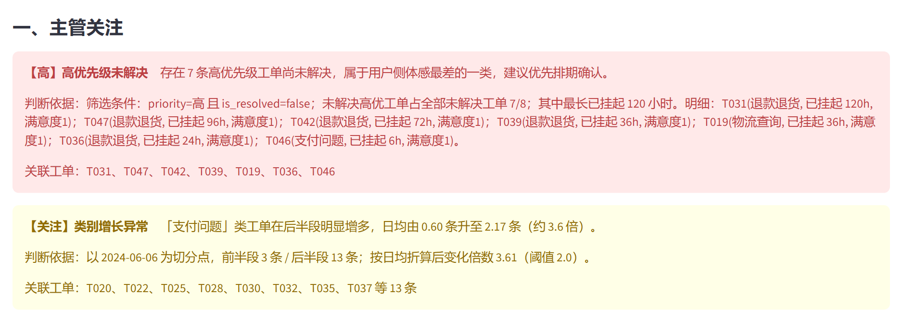</a>
</p>

### 截图 2 · 趋势分析（Trend Analysis）

<p align="center">
  <a href="screenshots/trend_analysis.png">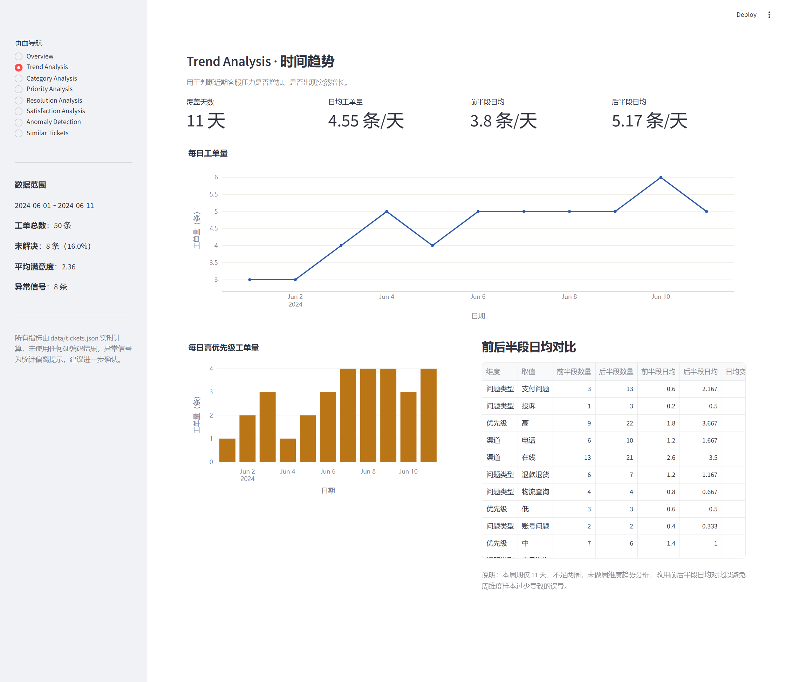</a>
</p>

**看点**：每日工单量折线（2024-06-01 ~ 06-11，峰值 06-10 的 6 条）、每日高优先级工单量柱状图，
以及「前后半段日均对比」表 —— 日均工单量由 **3.8 → 5.17 条/天（+36%）**，
用日均折算避免了「两段时间天数不同」带来的假增长。

### 截图 3 · 异常检测（Anomaly Detection）

<p align="center">
  <a href="screenshots/anomaly_analysis.png">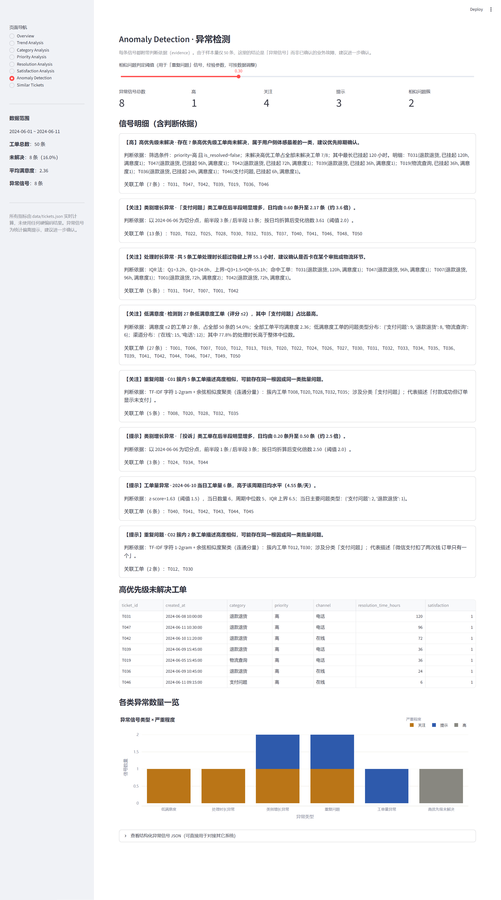</a>
</p>

**看点**：本项目最核心的页面。8 条异常信号逐条展开，每条都给出 **evidence（判断依据）** 与关联工单；
下方是高优先级未解决工单明细表与「异常类型 × 严重程度」堆叠图；
页面顶部提供相似度阈值滑块，可实时调整「重复问题」信号的判定严格程度。

**细节放大 · 单条信号的判断依据**（这是「结论必须可追溯」的直接体现）：

<p align="center">
  <a href="screenshots/detail_anomaly_evidence.png">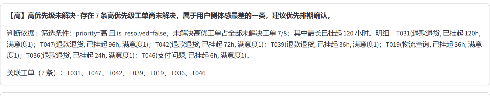</a>
</p>

### 截图 4 · 相似 / 重复问题（Similar Tickets）

<p align="center">
  <a href="screenshots/similar_tickets.png">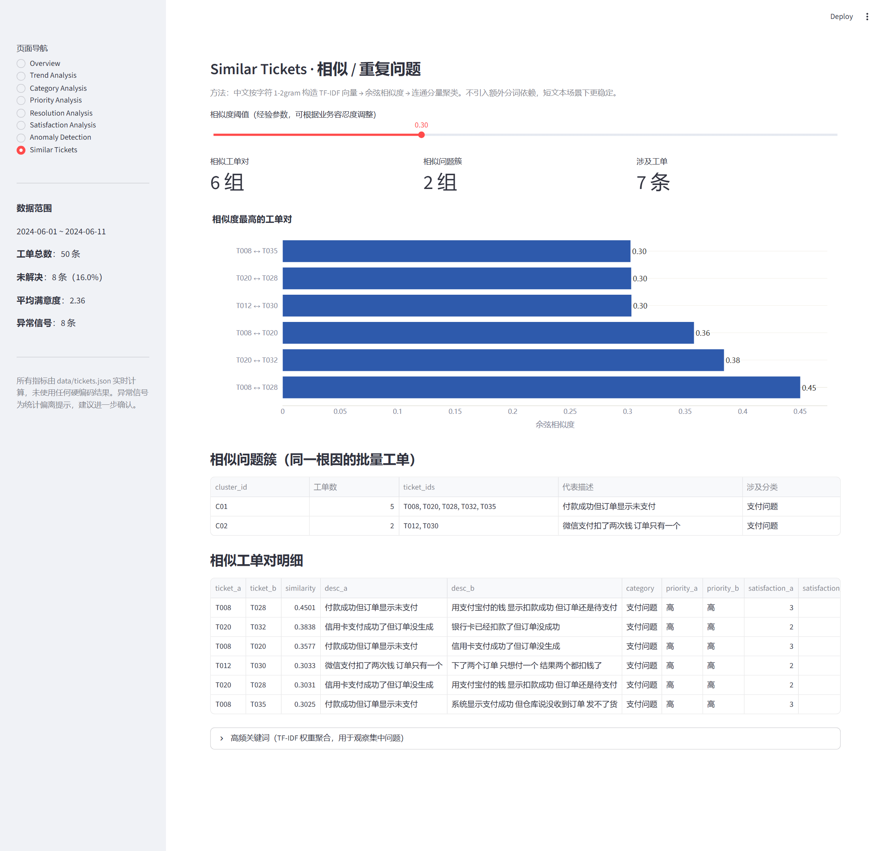</a>
</p>

**看点**：TF-IDF + 余弦相似度的实际效果 —— 阈值 0.30 下命中 **6 组相似工单对、2 个问题簇**，
并可看到 `ticket_a / ticket_b / similarity / 两条描述` 的完整明细。

**细节放大 · 相似问题簇**（同一根因的批量工单）：

<p align="center">
  <a href="screenshots/detail_similar_clusters.png">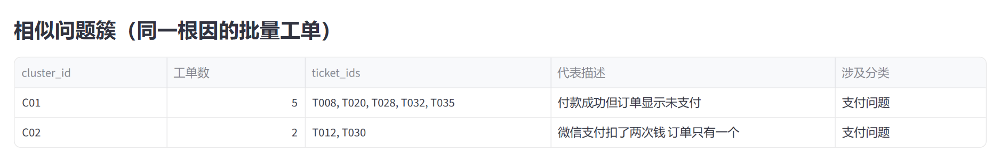</a>
</p>

C01 簇把 5 条描述各异的工单（T008、T020、T028、T032、T035）识别为同一根因
「付款成功但订单状态异常」，跨 7 天反复出现；C02 簇识别出 2 条重复扣款。

### 其他页面 · 问题类型与满意度

<table>
  <tr>
    <td width="50%">
      <a href="screenshots/category_analysis.png">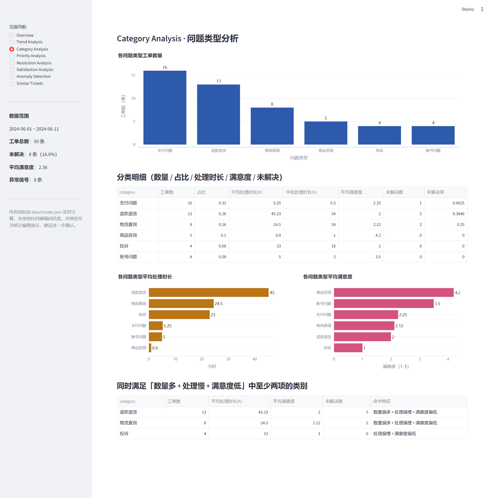</a><br>
      <sub><b>Category Analysis</b>：各类别数量 / 占比 / 平均处理时长 / 平均满意度 / 未解决数，
      并交叉筛选出「数量多 + 处理慢 + 满意度低」的类别。</sub>
    </td>
    <td width="50%">
      <a href="screenshots/satisfaction_analysis.png">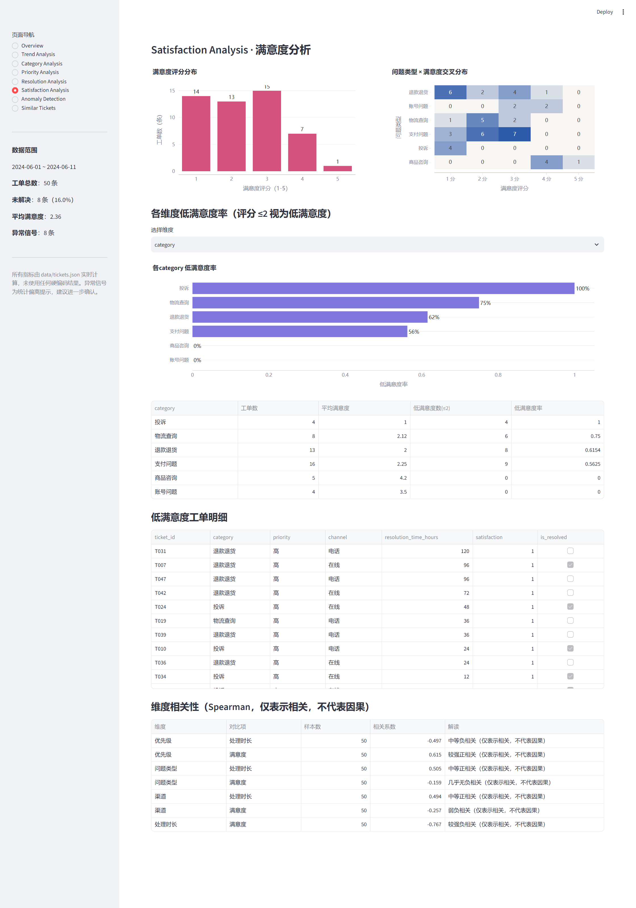</a><br>
      <sub><b>Satisfaction Analysis</b>：满意度分布、类别 × 满意度热力图、各维度低满意度率，
      以及 Spearman 相关性表（只描述相关，不做因果推断）。</sub>
    </td>
  </tr>
</table>

### 截图 5 · 线上部署（Docker + 云服务器）

<p align="center">
  <a href="screenshots/deployed_cloud.png">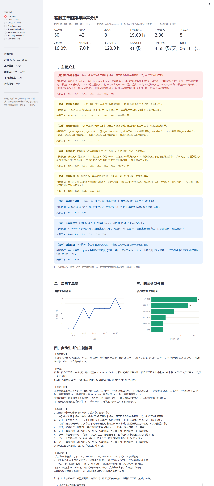</a>
</p>

**看点**：这是**云服务器上真实运行的实例**截取的页面（<http://134.185.89.68:8501>），
不是本地截图——页面内容高度与本地一致（3577px），说明 Docker 镜像内的数据、中文渲染与图表全部正常。
下方是部署后的容器状态：

```text
$ docker ps --filter name=smartticket
NAMES                   STATUS                    PORTS
smartticket-analytics   Up (healthy)              0.0.0.0:8501->8501/tcp, [::]:8501/tcp

$ curl -s -o /dev/null -w '%{http_code}\n' http://134.185.89.68:8501/_stcore/health
200
```

### 截图 6 · 开发过程

**① 需求拆解** —— 拿到题目后先把 15 项核心要求逐条落到实现清单上，
再据此决定模块划分（数据层 / 指标层 / 异常层 / 展示层）：

<p align="center">
  <a href="screenshots/development_requirements.png">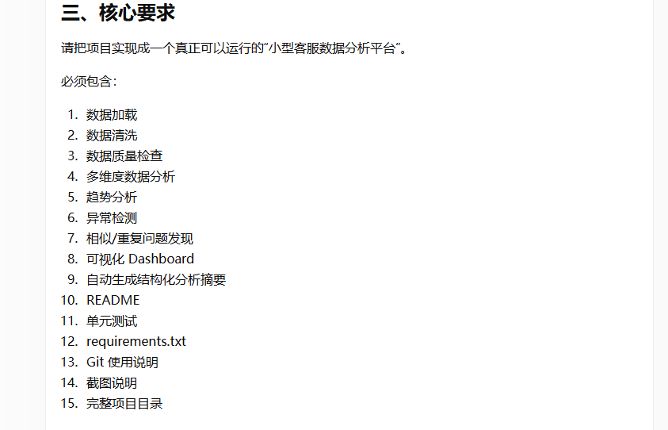</a>
</p>

**② AI 协作记录** —— 用 AI 工具辅助做技术选型（为什么不上 LangChain / RAG）、
模块拆分与 README 结构整理；所有数据结论均由程序计算，不经 AI 之手：

<p align="center">
  <a href="screenshots/development_ai_chat.png">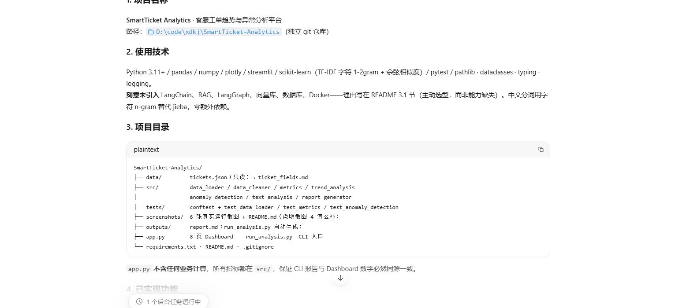</a>
</p>

> 说明：以上两张为开发者实际开发过程中的记录。若需要更完整的「IDE + 终端」画面，
> 可补充截取 `pytest -q` 与 `streamlit run app.py` 的终端输出，具体清单见
> [`screenshots/README.md`](screenshots/README.md)。

---

## 13. 局限性（如实说明）

1. **样本量只有 50 条、时间跨度仅 11 天**：所有统计判定（z-score、IQR、倍数对比）都建立在很小的样本上，只能作为**关注方向提示**，不足以支撑确定性结论。这也是本项目中所有输出措辞统一为「异常信号」的原因。
2. **无历史基线**：没有去年同期/上月的对照数据，因此「增长」只能与**本周期内部的前后半段**比较，无法区分季节性波动与真实异常。
3. **相似度阈值是经验参数，不是绝对标准**：实测阈值敏感性如下：

   | 阈值 | 相似工单对 | 问题簇 | 实际效果 |
   | --- | --- | --- | --- |
   | 0.15 | 37 | 4 | **过度聚合**：一个簇把 23 条不同问题混在一起，失去可用性 |
   | 0.20 | 21 | 8 | 召回高但噪声明显 |
   | **0.30（默认）** | 6 | 2 | **本数据集的最佳折中**：C01（订单状态异常 5 条）+ C02（重复扣款 2 条），准确且干净 |
   | 0.35 | 3 | 1 | 偏严格，C02 消失 |
   | 0.40 | 1 | 1 | 几乎只剩最相似的一对 |

   Dashboard 的「相似工单」页提供了阈值滑块，业务方可以按自己的容忍度调整。

4. **已知漏召回案例（重要）**：T022「重复扣款 请帮我退回来」与 T046「又出现重复扣款了 上个月也有过」明显属于同一根因，但在默认阈值 0.30 下**未能聚合**（需降到 0.20 才会合并，同时会引入噪声）。根因是描述过短（9~13 字），字符 n-gram 重叠不足。
   **改进方向**：引入业务同义词词典对短文本做归一化（如「扣款/扣钱/扣了钱」统一），或改用 sentence-transformers 之类的句子向量做语义相似度——后者会引入更重的依赖，需权衡部署成本。
5. **相关性 ≠ 因果**：代码与 README 中所有关系描述都使用「存在相关性」，例如「超长处理时长与低满意度共存」，不能据此断言时长导致了差评（也可能是问题本身难度高同时导致两者）。
6. **类别判定依赖工单的分类标签**：若上游打标不准，所有基于 `category` 的结论都会连带失真。本项目未做打标准确性校验（原始数据中没有可核对的真值）。
7. **异常检测阈值需按业务节奏调参**：`DAILY_SPIKE_Z_THRESHOLD`、`CATEGORY_GROWTH_RATIO` 等常量都集中在 `src/anomaly_detection.py` 顶部，接入真实业务数据后应结合历史分布重新标定，而不是沿用当前经验值。

---

## 14. Git 与交付

### 14.1 仓库信息

| 项目 | 值 |
| --- | --- |
| 远程仓库 | <https://github.com/messiiss/SmartTicket-Analytics> |
| 主分支 | `main`（已配置 upstream 跟踪） |
| Git 历史 | 10 个提交，按「初始化 → 数据层 → 指标层 → 异常层 → Dashboard → 测试 → 文档 → 容器化」顺序组织 |

### 14.2 提交记录

```text
docs: add docker deployment and online demo links     # 更新 README 线上地址与部署说明
docs: embed dashboard screenshots and detail crops in README
chore: add CLI pipeline entry and generated analysis report
docs: add project README and dashboard screenshots
test: add analysis tests
feat: add streamlit dashboard
feat: add anomaly detection and TF-IDF similar ticket analysis
feat: add multi-dimension metrics, trend analysis and report generator
feat: add ticket data loading and cleaning with quality checks
feat: initialize smart ticket analytics project
```

### 14.3 常用命令

```bash
git clone https://github.com/messiiss/SmartTicket-Analytics.git   # 克隆
git add .
git commit -m "feat: xxx"
git push                                                          # 推送到 main
```

`.gitignore` 已排除 `.venv/`、`__pycache__/`、`.pytest_cache/`、`.streamlit/`、`*.pyc`、`.env`、`.DS_Store`。
`.dockerignore` 另外排除了 `.git/`、截图、文档等，保证镜像里只有运行必需的内容。

> 安全说明：仓库中**不含任何密钥**。`.env`、`*.key`、`*.pem` 均在两个 ignore 文件中被排除，
> 可执行 `git ls-files | grep -E "\.env|\.key|\.pem"` 确认结果为空。

---

*本项目为 AI 测评任务（0111 · 客服工单趋势分析）的交付物。*
*在线演示：<http://134.185.89.68:8501>　|　代码仓库：<https://github.com/messiiss/SmartTicket-Analytics>*
